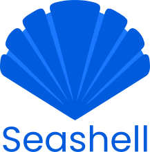

<p align="center">
<br><br>
<a href="https://goreportcard.com/report/go.elara.ws/seashell"></a>&nbsp;
<a href="https://gitea.elara.ws/Elara6331/seashell/wiki/Home"></a>
</p>

---

Seashell is a custom SSH server that implements virtual hosts with username-based routing, allowing users to securely access shells inside VMs, containers, or even on serial ports. It also features its own authentication and permissions system, independent of system users.

## Features

### Fail2Ban

Seashell has a built-in rate limiter for failed logins. If a user exceeds the configured amount of failed login attempts within the specified time interval, they will be blocked from making any further login attempts until the time interval passes.

### Permissions

Seashell comes with a granular permissions system that allows you to allow or deny access to specific resources for specific users or groups of users. This allows you to safely provide shell access to users without also giving them access to any unintended resources.

## Integrations

### Docker

Seashell can integrate with Docker to provide remote shell access into a container. For example, with a route configured to match `docker\\.(.+)`, you can use the following `ssh` command to get a shell inside the `example` container:

```bash
ssh user:docker.example@ssh.example.com
```

See the [docker](https://gitea.elara.ws/Elara6331/seashell/wiki/Backends#docker) documentation for more info.

### Nomad

Seashell can integrate with a Nomad cluster to provide remote shell access into a Nomad allocation. For example, with a route configured to match `nomad\\.(.+)`, you can use the following `ssh` command to get a shell in the first allocation in the `example` job:

```bash
ssh user:nomad.example@ssh.example.com
```

If your job has several tasks, you can specify the task you want like so:

```bash
ssh user:nomad.example.mytask@ssh.example.com
```

See the [nomad](https://gitea.elara.ws/Elara6331/seashell/wiki/Backends#nomad) documentation for more info.

### Serial

Seashell can provide remote access to a physical serial port. For example, with a route configured to match `serial\\.(.+)`, you can use the following `ssh` command to get a access to `/dev/ttyS0`:

```bash
ssh user:serial.ttyS0@ssh.example.com
```

If the baud rate and mode are unknown beforehand, you can specify them in the ssh command, like so:

```bash
ssh user:serial.ttyS0.115200.8n1@ssh.example.com
```

See the [serial](https://gitea.elara.ws/Elara6331/seashell/wiki/Backends#serial) documentation for more info.

### Proxy

Seashell can proxy another SSH server. In this case, your client will authenticate to seashell and then seashell will authenticate to the target server, so you should provide seashell with a private key to use for authentication and encryption. If you don't provide this, seashell will ask the authenticating user for the target server's password.

Here's an example command:

```bash
ssh user:myproxy@ssh.example.com
```

See the [proxy](https://gitea.elara.ws/Elara6331/seashell/wiki/Backends#proxy) documentation for more info.